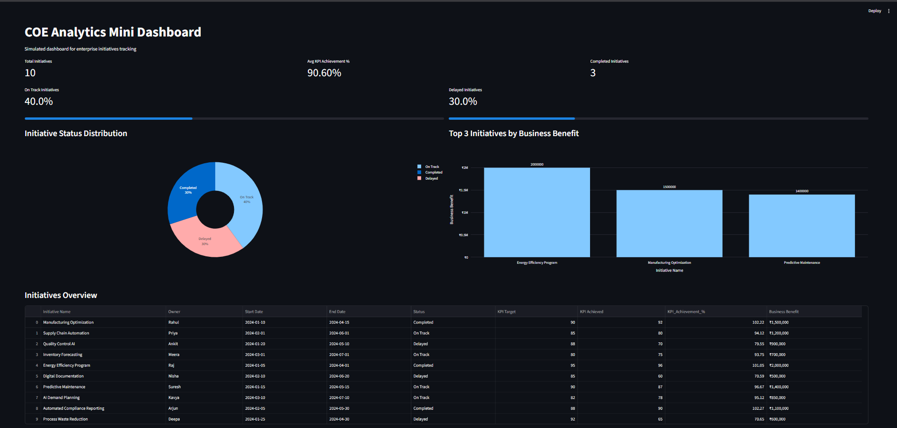
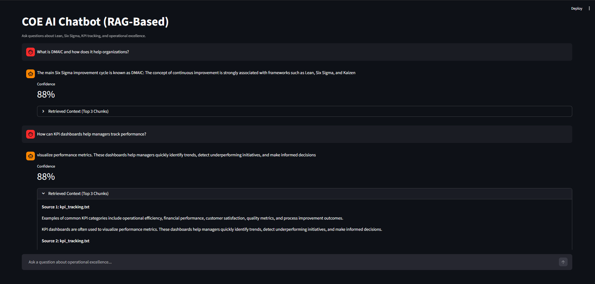

# COE Digital Enablement Prototype


A mini prototype developed for the Biocon Enterprise Analytics & AI.

The project demonstrates how a **Center of Excellence (COE) digital platform** can combine:

*  **Analytics dashboards**
*  **AI-powered knowledge assistant (RAG chatbot)**

to support **enterprise operational excellence initiatives**.

---
---

# Demo Screenshots

## COE Analytics Dashboard



The dashboard tracks initiative performance, KPI achievement, and business impact across operational excellence initiatives.

---

## COE AI Chatbot



The chatbot answers operational excellence questions using a **Retrieval-Augmented Generation (RAG)** pipeline with FAISS vector search.
# Overview

| Module                      | Purpose                                                          |
| --------------------------- | ---------------------------------------------------------------- |
| **COE Analytics Dashboard** | Tracks initiative progress, KPI performance, and business impact |
| **COE AI Chatbot (RAG)**    | Answers questions about operational excellence frameworks        |

Both modules are implemented using **Python and Streamlit**.

---

# Project Structure

```
coe-digital-enablement-prototype
│
├── screenshots/
│   ├── dashboard.png
│   └── chatbot.png 
│
├── data/
│   ├── coe_initiatives.csv
│   └── cleaned_coe_initiatives.csv
│
├── docs/
│   ├── lean_principles.txt
│   ├── six_sigma.txt
│   ├── kpi_tracking.txt
│   ├── excellence_framework.txt
│   └── continuous_improvement.txt
│
├── analytics.py
├── dashboard.py
├── rag_chatbot.py
├── requirements.txt
├── README.md
└── .gitignore
```

---

# Module 1 — COE Analytics Dashboard

This module analyzes a **simulated dataset of operational excellence initiatives**.

### Dataset Fields

| Field            | Description                        |
| ---------------- | ---------------------------------- |
| Initiative Name  | Name of the improvement initiative |
| Owner            | Responsible team or individual     |
| Start Date       | Initiative start date              |
| End Date         | Planned completion date            |
| Status           | On Track / Delayed                 |
| KPI Target       | Planned KPI improvement            |
| KPI Achieved     | Actual KPI achieved                |
| Business Benefit | Estimated value generated          |

---

## Data Cleaning & Analysis

Preprocessing steps performed:

* Removed duplicate records
* Converted date fields to datetime
* Calculated **KPI Achievement %**
* Checked for missing values
* Performed basic exploratory analysis

Example insights analyzed:

* Initiative status distribution
* Top initiatives by business benefit

---

## Dashboard Outputs

The **Streamlit dashboard** provides:

* Total number of initiatives
* On-track vs delayed initiatives
* Average KPI achievement
* Top 3 initiatives by business benefit
* Initiative performance overview table

---

# Module 2 — COE AI Chatbot (RAG)

A **Retrieval-Augmented Generation chatbot** that answers questions about operational excellence concepts using internal documents.

---

## Knowledge Base

The chatbot uses documents covering:

| Topic                             |
| --------------------------------- |
| Lean Principles                   |
| Six Sigma                         |
| KPI Tracking                      |
| Operational Excellence Frameworks |
| Continuous Improvement            |

---

# RAG Pipeline

```
Documents
   ↓
Document Loader
   ↓
Chunking
   ↓
Embeddings
   ↓
FAISS Vector Store
   ↓
Top-3 Retrieval
   ↓
LLM Answer Generation
   ↓
Answer + Sources + Confidence Score
```

---

# Implemented Features

* Document ingestion
* Recursive text chunking
* Sentence-transformer embeddings
* FAISS vector search
* Top-3 semantic retrieval
* LLM answer generation
* Source citation display
* Confidence scoring
* Streamlit chat interface

---

# System Architecture

```
                COE Digital Enablement Prototype
                             │
        ┌────────────────────┴────────────────────┐
        │                                         │
  Analytics Dashboard                        AI Chatbot
        │                                         │
 Simulated COE Dataset                    Knowledge Documents
        │                                         │
 Data Cleaning & Analysis               Chunking + Embeddings
        │                                         │
 KPI Metrics & Charts                   FAISS Vector Retrieval
        │                                         │
 Streamlit Dashboard                  LLM Answer Generation
        │                                         │
 Business Insights                Answer + Sources + Confidence
```

---

# Setup Instructions

## 1️⃣ Clone the repository

```bash
git clone <https://github.com/ajayvofficial0/Coe-digital-enablement-prototype>
cd coe-digital-enablement-prototype
```

---

## 2️⃣ Create a virtual environment

```bash
python -m venv venv
venv\Scripts\activate
```

---

## 3️⃣ Install dependencies

```bash
pip install -r requirements.txt
```

---

## 4️⃣ Run the analytics dashboard

```bash
streamlit run dashboard.py
```

---

## 5️⃣ Run the chatbot

```bash
streamlit run rag_chatbot.py
```

---

# Design Decisions

### Why Streamlit?

* Rapid prototyping
* Simple UI development
* Ideal for data and AI demos

---

### Why a Simulated Dataset?

Due to **enterprise data confidentiality**, the document required use of **sample datasets**.

---

### Why FAISS?

* High performance similarity search
* Lightweight integration
* Suitable for prototype-scale vector databases

---

### Why Sentence Transformers?

Model used: **all-MiniLM-L6-v2**

Benefits:

* Lightweight
* Fast embedding generation
* Good semantic retrieval performance

---

### Why FLAN-T5?

FLAN-T5 allows **local text generation** without needing paid APIs, making it suitable for a prototype.

---

# Governance Considerations

## Data Privacy Risks

Enterprise AI systems may process sensitive information such as:

* Internal documentation
* Operational performance data
* Strategic initiative details

Mitigation approaches:

* Role-based access control
* Document permission systems
* Data anonymization
* Secure storage for embeddings and logs

---

## Hallucination Risks

Even with RAG systems, incorrect answers may occur when:

* Retrieved context is weak
* Queries fall outside the knowledge base
* Limited context leads to overgeneralization

Mitigation strategies:

* Restrict answers to retrieved context
* Display sources
* Introduce confidence thresholds
* Improve retrieval quality

---

## 3. How Reliability Could Be Improved

Future improvements to enhance the reliability of the AI assistant may include:

- **Adding more domain-specific COE documents**  
  Expanding the knowledge base with curated enterprise documents can improve the relevance and completeness of retrieved information.

- **Improving chunking and document preprocessing**  
  Better document segmentation strategies can help ensure that retrieval returns more precise and contextually meaningful information.

- **Implementing reranking for higher retrieval quality**  
  A reranking model can prioritize the most relevant retrieved documents before they are passed to the language model.

- **Using stronger LLMs for more complete responses**  
  More capable language models can generate clearer explanations and better reasoning while still grounding responses in retrieved content.

- **Introducing query validation and relevance thresholds**  
  Queries can be validated to ensure they are within the scope of the knowledge base, reducing incorrect or hallucinated responses.

- **Collecting user feedback for iterative improvement**  
  Feedback mechanisms can help identify incorrect answers and continuously improve the system over time.


# Adoption Metrics

Useful metrics for enterprise AI assistants:

| Metric                | Description                        |
| --------------------- | ---------------------------------- |
| Query Resolution Rate | % of queries successfully answered |
| Usage Frequency       | Queries per user per week          |
| User Feedback Score   | Helpfulness and relevance ratings  |

Additional metrics:

* Source click rate
* Repeat usage
* Unanswered query rate

---

# Example Chatbot Questions

Example queries supported by the chatbot:

* What is DMAIC and how does it help organizations?
* How do Lean principles reduce waste?
* How can KPI dashboards help managers track performance?
* What frameworks support operational excellence?

---

# Conclusion

This prototype demonstrates a **COE digital enablement system** combining **analytics and AI assistance**.

The system provides:

* **Initiative performance visibility**
* **AI-powered knowledge access**

Together, these capabilities support **enterprise operational excellence and data-driven decision making**.

---
